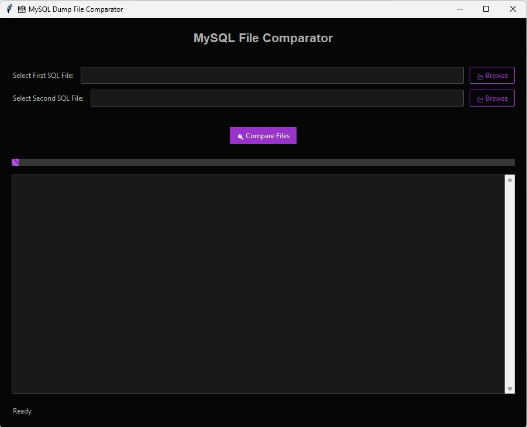
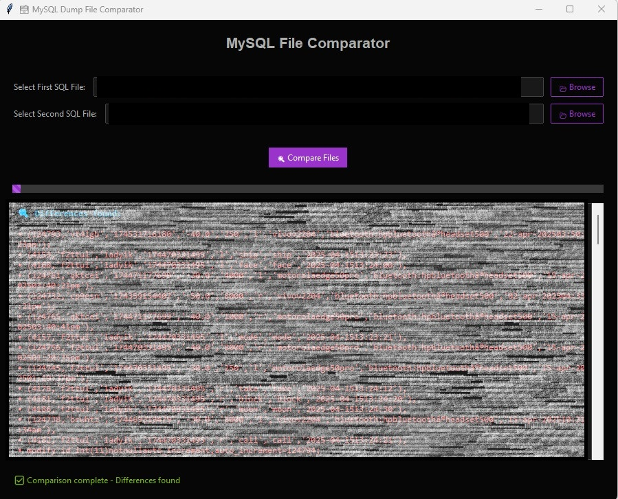
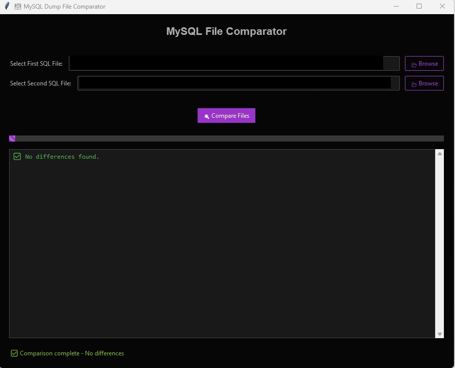

# MySQL File Comparator

A modern, user-friendly desktop application for comparing MySQL database dump files. Built with Python and Tkinter, this tool helps developers and database administrators quickly identify differences between SQL files.

## Screenshots

### Main Interface


### Differences Found


### No Differences Found


## Features

- 🎨 Modern, dark-themed user interface
- 🔍 Fast and efficient file comparison
- 📊 Visual progress indicator
- 📝 Clear difference highlighting
- 🚀 Asynchronous processing for smooth user experience
- 💾 Supports all SQL file formats
- 🎯 Accurate comparison with smart line normalization

## Installation

1. Clone the repository:
```bash
git clone https://github.com/yourusername/mysql-file-comparator.git
cd mysql-file-comparator
```

2. Install the required dependencies:
```bash
pip install -r requirements.txt
```

## Requirements

- Python 3.7 or higher
- ttkbootstrap
- tkinter (usually comes with Python)

## Usage

1. Launch the application:
```bash
python comparision_database.py
```

2. Select your SQL files:
   - Click "Browse" to select the first SQL file
   - Click "Browse" to select the second SQL file
   - Click "Compare Files" to start the comparison

3. View the results:
   - Differences are highlighted in the results panel
   - Status messages appear in the status bar
   - Progress is shown during comparison

## How It Works

The application compares SQL files by:
1. Normalizing each line (removing whitespace and converting to lowercase)
2. Ignoring comments (lines starting with '--')
3. Creating sets of unique lines from each file
4. Finding the symmetric difference between the sets
5. Displaying the results with appropriate formatting

## Contributing

Contributions are welcome! Please feel free to submit a Pull Request.

## License

This project is licensed under the MIT License - see the [LICENSE](LICENSE) file for details.

## Acknowledgments

- Built with [ttkbootstrap](https://ttkbootstrap.readthedocs.io/) for modern UI components
- Inspired by the need for efficient SQL file comparison tools

## Support

If you encounter any issues or have suggestions, please open an issue in the repository.